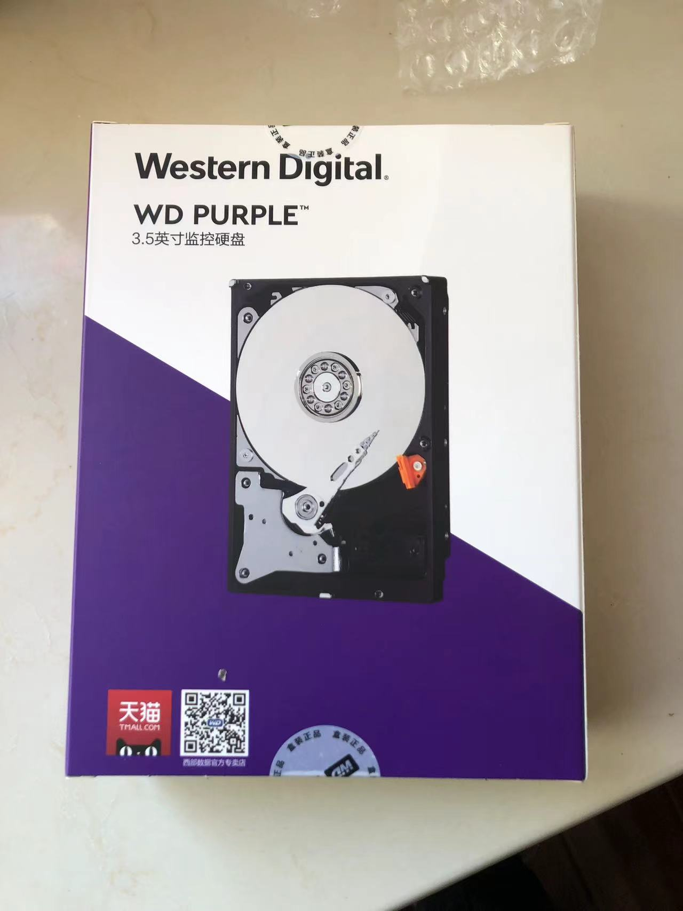

## 前言
最初，家里的一些老照片和老的资料是放在老电脑的硬盘中。不巧的是，老电脑的硬盘可能是被误格式化，导致资料丢失。刚放假的时候，出于想尝试的目的，以及想要找回一些资料的目的，我尝试了一下数据恢复，自此开始，我开始构建自己的资料冷备份体系。

首先说明，我对资料的备份和恢复懂的并不多，这里记录的方法可能是错的或者并不是最适合你的方法，只是希望记录下来，以便以后查阅。欢迎各位大佬指正。

## 数据恢复
因为数据之前有部分被覆写，加上硬盘也被重新格式化了，因此，我选择使用`DiskGenius`恢复数据，最终，我成功找到了不少资料和一些照片。但因为数据部分被覆盖，很多照片都丢失了。由此可见，数据无价并不是闹着玩的。

当时我操作的方法也很土，使用`Ventoy`启动了我移动硬盘中的`Win to go`系统，然后在`Win to go`系统中安装了`DiskGenius`，最后使用`DiskGenius`恢复数据。这种方法的好处是不用拆机，但因为在老电脑上运行，速度显然受到了老电脑机能的限制。不过经过一个下午的时间，经过筛选后，也找到了不少资料。

从DiskGenius中恢复的资料，我将其放在了移动硬盘中，但这些资料没有文件名，需要手动整理。为了不让自己太累，我直接让Copilot辅助我写了一个小程序，来用于将word文档中的标题作为文件名。这样，我就可以直接通过文件名来找到我想要的资料了。

同样，表格文件也借助了差不错的方法解决。自此，资料初步整理完成。

## 冷备份老资料
显然，放在我的移动硬盘中以及电脑中也不是长久之际，我有定期清理空间的习惯。另外，移动硬盘存在丢失的风险。在网上浏览一圈之后，看到了“冷备份”这个词。由此，我开始挑选备份介质。

### 挑选介质
首先必须明确一点，目前因为预算方面问题，我的预算并不太够。幸运的是，目前来说，我需要冷备份的资料并不是很多，也并不需要太大的储存空间。不过考虑到介质可能很久才打开检查一次，我根据需要选择机械硬盘。

可能去看大部分博主的推荐，都会告诉你，目前4TB以下的机械硬盘都不那么推荐。不过考虑到预算和上述的实际需求，经过多方面学习，最终选择了2块全新的西数的1TB紫盘来完成我的任务。

读取硬盘，目前我选用的是绿联的硬盘盒。建议替换自带的电源，但我目前预算不足，没有替换。

### 拷贝资料
我没有组Raid的条件，故我选择手动“镜像”两个盘的文件。我先拆封了一个盘，在电脑上整理好所有资料，使用fastcopy将资料复制到硬盘目录。使用fastcopy纯粹是因为他可以在拷贝资料的时候校验，拷贝大文件的时候也相对较快，体验较好。

在弹出硬盘时，注意先在电脑上选择弹出，等待数秒保证硬盘停转和磁头归位后，关闭硬盘盒电源并拔出硬盘。这样做，一方面可以防止硬盘还在读写，另一方面，磁头离开硬盘盘面后，可以防止移动时磁头划伤硬盘，变成“唱片机”。

### 定期查看和写入资料
一般来说，每个阶段之后，都需要将一些资料进行备份。我建议周期是半年到一年定期检查下。当然，有重要资料的时候，也别忘记写入，时间有限的话，也可以一同检查下硬盘的smart值。

对于用于备份的机械硬盘来说，smart值还挺重要的，有时候smart出现警告后，要及时考虑转移资料和选择新硬盘进行备份。

## 总结
对于每个人来说，都有或多或少的重要资料。永远要记住：“数据无价”。定期做好数据备份是一项不错的选择，不要等到失去了再追悔莫及。

这里有个小插曲，我在3月份的时候，无意中格式化了Windows系统盘。因为备份习惯，导致我的资料和进度丢失并不算太多，所以还是那句话，数据无价，勤备份才是王。
