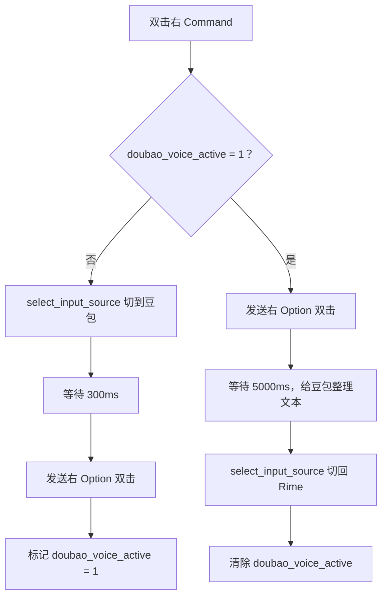

今天早上装了豆包输入法。起因很简单——看了一些关于它语音后处理的讨论，好奇一个外挂了小语言模型的输入法，在语音转文字这件事上到底能做到什么程度。试了一圈下来，识别准确率和文本优化确实超出了预期。不过我没打算把它设为主力输入法。日常打字我还是习惯 Rime / 鼠须管，无论手感还是隐私考量都更顺手。所以策略很明确：**打字归 Rime，说话归豆包。**

但问题也跟来了。豆包的语音输入只有在豆包输入法本身处于激活状态时才稳定——这意味着每次想用语音，得先手动切到豆包，用完再切回去。一次两次还好，频繁操作就很打断节奏。我需要一个更轻的方式，把"切换→语音→切回"这个流程压缩成一次操作。

之前其实写过一篇关于豆包输入法整体体验的文章（《[用嘴写 Prompt：豆包输入法如何成为我与 AI 对话的「语音中介」](https://blog.cold04.com/p/doubaoime_first_test/)》），聊的是语音后处理的价值和工作流整合。这篇不重复那些，只聚焦一个问题：怎么用 Karabiner 把豆包当成一个"随叫随走"的语音工具。

---

## 想清楚要做什么

需求拆开来看其实就三步：切到豆包、触发语音、用完切回 Rime。如果再加一个约束——不引入新的常驻工具，只在已有的 Karabiner-Elements 里解决——那就变成了一个 Karabiner 规则设计问题。

键位选择上没太多纠结。右 Command 平时几乎不用，不跟 Fn / Globe 的系统切换打架，也不影响我 Caps Lock 上已有的组合规则。交互逻辑也很快定下来：双击右 Command，第一次唤醒语音，第二次结束并切回。

真正让我折腾了一下午的，是第二步——"触发语音"这四个字。

## 右 Option 双击，到底谁来发

豆包输入法的语音输入，默认通过双击右 Option 唤醒。问题在于，不是随便一个"右 Option"它都认。

我最先用 `osascript` 模拟 key code 61 试了一下。按键确实发出去了，但豆包毫无反应，就像什么都没收到一样。然后换成 Swift 写了个小工具，用 CGEvent 来发右 Option——这次偶尔能唤醒，但十次里大概只有三四次成功，完全不可靠。

最后用 Karabiner 自己的 `to` 规则直接发 `right_option`，一次就通了。

这个差异其实挺有意思的。`osascript` 的 System Events、CGEvent 的底层事件、Karabiner 发出的按键——它们走的是不同的事件通道和处理层级。豆包显然在某个层面做了过滤，只认 Karabiner 那种更"原生"的按键事件。具体是内核扩展层级的问题还是输入法进程的优先级问题，我没有深挖，但结论很清楚：右 Option 双击必须由 Karabiner 直接发，不能绕道外部脚本或工具。

这个发现也让后续方案简化了不少。既然按键模拟只能交给 Karabiner，那输入法切换也干脆用 Karabiner 内置的 `select_input_source`，整条链路都在一个工具里闭环。

## 规则是怎么搭起来的

方案的核心是两个变量：`right_command_tapped_once` 标记右 Command 是否已经被单按过一次（用于判断是不是双击），`doubao_voice_active` 记录当前是否在语音流程中。

整个规则拆成三段。第一段处理"激活语音"：当系统检测到双击右 Command、且当前不在语音状态时，依次执行切到豆包、等待 300 毫秒让输入法完成切换、发送右 Option 双击唤醒语音，最后把状态变量置位。

第二段处理"退出语音"：在语音状态下再次双击右 Command，先发一次右 Option 双击让豆包结束当前语音并进入文本处理，然后等 5 秒让它完成优化，最后切回 Rime 并清掉状态变量。

第三段是双击识别的基础——利用 Karabiner 的 `to_if_alone` 机制，单按右 Command 时把 `right_command_tapped_once` 设为 1。如果用户在超时时间内再次按下右 Command，前两段规则就会根据状态变量判断该走激活还是退出。



如果你想根据自己的习惯调整规则（例如更换触发键、修改输入法 ID 或调整等待延迟），可以将下面的 JSON 规则喂给 AI（如 ChatGPT 或 Claude），让它参考这个逻辑为你生成定制化的配置。受限于文章篇幅，你也可以将文章链接交由 AI ，辅助教学您如何在 Karabiner 配置相关规则。

这套规则的核心价值在于实现了一个**全局快速唤醒的工作流**：无论你在哪个 App 下，只需双击右 Command 即可瞬间切到豆包并开启语音输入，说完再次双击即可自动切回主力输入法（如 Rime），将“切换→语音→切回”的繁琐操作压缩成了一个连贯的交互。

下面是完整的 Karabiner 规则：

```json
{
  "description": "Double tap Right Command: switch to Doubao and send right Option twice; double tap again switches back to Rime",
  "manipulators": [
    {
      "conditions": [
        {
          "name": "right_command_tapped_once",
          "type": "variable_if",
          "value": 1
        },
        {
          "name": "doubao_voice_active",
          "type": "variable_unless",
          "value": 1
        }
      ],
      "from": {
        "key_code": "right_command",
        "modifiers": { "optional": ["any"] }
      },
      "to": [
        {
          "select_input_source": {
            "input_source_id": "^com\\.bytedance\\.inputmethod\\.doubaoime\\.pinyin$"
          }
        },
        {
          "hold_down_milliseconds": 300,
          "key_code": "vk_none"
        },
        {
          "hold_down_milliseconds": 60,
          "key_code": "right_option"
        },
        {
          "hold_down_milliseconds": 60,
          "key_code": "right_option"
        },
        {
          "set_variable": {
            "name": "doubao_voice_active",
            "value": 1
          }
        },
        {
          "set_variable": {
            "name": "right_command_tapped_once",
            "value": 0
          }
        }
      ],
      "type": "basic"
    },
    {
      "conditions": [
        {
          "name": "right_command_tapped_once",
          "type": "variable_if",
          "value": 1
        },
        {
          "name": "doubao_voice_active",
          "type": "variable_if",
          "value": 1
        }
      ],
      "from": {
        "key_code": "right_command",
        "modifiers": { "optional": ["any"] }
      },
      "to": [
        {
          "hold_down_milliseconds": 60,
          "key_code": "right_option"
        },
        {
          "hold_down_milliseconds": 60,
          "key_code": "right_option"
        },
        {
          "hold_down_milliseconds": 5000,
          "key_code": "vk_none"
        },
        {
          "select_input_source": {
            "input_source_id": "^im\\.rime\\.inputmethod\\.Squirrel\\.Hans$"
          }
        },
        {
          "set_variable": {
            "name": "doubao_voice_active",
            "value": 0
          }
        },
        {
          "set_variable": {
            "name": "right_command_tapped_once",
            "value": 0
          }
        }
      ],
      "type": "basic"
    },
    {
      "from": {
        "key_code": "right_command",
        "modifiers": { "optional": ["any"] }
      },
      "parameters": {
        "basic.to_delayed_action_delay_milliseconds": 450,
        "basic.to_if_alone_timeout_milliseconds": 250
      },
      "to": [
        {
          "key_code": "right_command",
          "lazy": true
        }
      ],
      "to_delayed_action": {
        "to_if_canceled": [
          {
            "set_variable": {
              "name": "right_command_tapped_once",
              "value": 0
            }
          }
        ],
        "to_if_invoked": [
          {
            "set_variable": {
              "name": "right_command_tapped_once",
              "value": 0
            }
          }
        ]
      },
      "to_if_alone": [
        {
          "set_variable": {
            "name": "right_command_tapped_once",
            "value": 1
          }
        }
      ],
      "type": "basic"
    }
  ]
}
```

## 两个等待，各有用意

规则里有两处 `vk_none` 配合 `hold_down_milliseconds` 做的等待，一开始可能觉得多余，实际上各有各的必要。

第一个 300 毫秒在切到豆包之后、发右 Option 之前。输入法切换不是瞬间完成的——如果按键发得太急，豆包还没完全激活，右 Option 事件就会被吞掉。300 毫秒是个经验值，我的机器上没出过问题。如果你的 Mac 比较老或者后台比较重，可以适当调大。

第二个 5 秒在退出时。最早我试过秒切——语音结束立刻切回 Rime——结果发现豆包经常只输出了一半，文本优化根本没做完。后来改成了先等 5 秒再切，问题就消失了。这个值可以根据习惯调：通常说短句三四秒就够了，长篇大论可能需要八秒。觉得慢就调小，发现切回去还是半成品就调大，没什么神秘的地方。

## 关于方案选型

中间也纠结过要不要用 Hammerspoon。它能力确实更强，能监听按键的按下和释放事件，写一个完整的状态机完全没问题。但需求本身并不复杂——就是双击切换加两个等待——为了这个让 Hammerspoon 常驻在后台，有点杀鸡用牛刀的感觉。而且实测下来，Karabiner 直接发的 `right_option` 是唯一能稳定唤醒豆包的方式，换成 Hammerspoon 反而可能重蹈 CGEvent 的覆辙。

Shell 脚本也是类似的情况。一开始打算用 `macism` 做输入法切换，`osascript` 发按键，但因为右 Option 的模拟问题，这条路一开始就走不通。目前这版完全不依赖外部脚本，切换直接用 Karabiner 内置的 `select_input_source`。如果后面发现 `select_input_source` 在某些 macOS 版本上不稳定，也随时可以退回去调用 `shell_command` 执行 `macism`——但右 Option 双击一定得留在 Karabiner 这边。

这个方案用了一下午，跑了十几轮语音输入，目前没出过岔子。如果你也面临类似的需求——主力输入法不想换，但偶尔想用豆包语音——可以参考这个思路。规则里的 input_source_id 改成你自己的输入法就行，等待时间按习惯微调，其他的应该都能直接用。

* 本文脚本内容由作者亲自实验，文章整理交由AI辅助完成 *